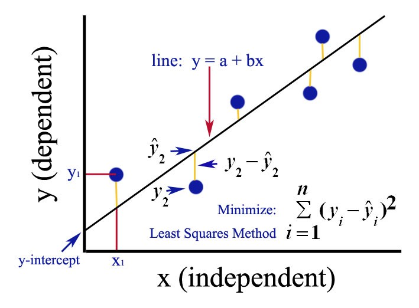
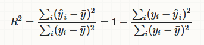

= Simple Linear Regression

// tag::introduction[]
Simple linear regression is a linear approach for modeling the relationship between two variables. The *dependent* variable, "__y__", is the quantity we would like to predict. We predict the dependent variable using the known value of the *independent* variable, "__x__". The goal of simple linear regression is to create a function that takes the independent variable as input and outputs a prediction for the value of the dependent variable. Remember algebra class? Since the model is a line, writing it in the form `y = a + b*x` allows it to be uniquely represented by two parameters: slope (**b**) and intercept (**a**). 

Visually, there is a plot of several (__x__, __y__) data points. Simple linear regression finds the line through the points that _best "fits" the data_. This is one of the most popular tools in statistics, and it is frequently used as a predictor for machine learning.
// end::introduction[]

== Explanation and history

// tag::explanation[]
At the core of linear regression is the method of least squares. In this method, we find the coefficients *a* and *b* that minimize the sum of squared differences between each observation's *actual* __y__-value and its *predicted* __y__-value according to the linear model `y = a + b*x`. 

The method of least squares was independently discovered by Carl Friedrich-Gauss and Adrien-Marie Legendre in the early 19th century. The linear regression methods used today can be primarily attributed to the work of R.A. Fisher in the 1920s.
// end::explanation[]

== Use-cases

// tag::use-case[]
In simple linear regression, both the independent and dependent variables must be numeric. The dependent variable (__y__) can then be expressed in terms of the independent variable (__x__) using the two line parameters intercept (**a**) and slope (**b**) with the equation `y = a + b * x`. For these approximations to be meaningful, the dependent variable should take continuous values. The relationship between any two variables satisfying these conditions can be analyzed with simple linear regression. However, the model will only be successful for linearly related data. Some common examples include:

* Predicting housing prices with square footage, number of bedrooms, number of bathrooms, etc.
* Analyzing sales of a product using pricing or performance information
* Calculating causal relationships between parameters in biological systems
// end::use-case[]

== Constraints

// tag::constraints[]
Because simple linear regression is so straightforward, it can be used with any numeric data pair. The real question is how well the best model fits the data. There are several measurements which attempt to quantify the success of the model, or how well it "fits" the data. For example, the _coefficient of determination (R^2^)_ is the proportion of the variance in the dependent variable that is predictable from the independent variable. A coefficient R^2^ = 1 indicates that the variance in the dependent variable is entirely predictable from the independent variable (and thus the model is perfect).

// end::use-case[]

== Example

Let's look at a straightforward example--predicting short term rental listing prices using the listing's number of bedrooms. Run `:play http://guides.neo4j.com/listings` and follow the import statements to load Will Lyon's rental listing graph.

.First split the data set and label 75% as training data (used to create the model)
[source,cypher]
----
MATCH (list:Listing)-[:IN_NEIGHBORHOOD]->(:Neighborhood {neighborhood_id:'78704'})
WHERE exists(list.bedrooms) AND exists(list.price)
WITH regression.linear.split(collect(id(list)), 0.75) AS trainingIDs
MATCH (list:Listing) WHERE id(list) in trainingIDs
SET list:Train
----

.And add the :Test label to the remaining 25% of listing nodes in the data set (used to test the model on unseen data)
[source,cypher]
----
MATCH (list:Listing)-[n:IN_NEIGHBORHOOD]->(hood:Neighborhood {neighborhood_id:'78704'})
WHERE exists(list.bedrooms) AND exists(list.price) AND NOT list:Train
SET list:Test
----

.Initialize the model
[source,cypher]
----
CALL regression.linear.create('rental prices', 'Simple')
----

.Then add training data point by point
[source,cypher]
----
MATCH (list:Listing:Train) WHERE NOT list:Seen
CALL regression.linear.add('rental price', [list.bedrooms], list.price)
SET list:Seen
----

.Check the model's name, framework, constant term, number of variables, state, number of data points, and statistics
[source,cypher]
----
CALL regression.linear.info('rental prices')
----

.Add testing data to check the model's performance on unseen data
[source,cypher]
----
MATCH (list:Listing:Test) WHERE NOT list:Seen
CALL regression.linear.add('rental prices', [list.bedrooms], list.price, 'test')
SET list:Seen
----

.Perform testing calculations
[source,cypher]
----
CALL regression.linear.test('rental prices')
---- 

.Next predict price for a four-bedroom listing
[source,cypher]
----
RETURN regression.linear.predict('rental prices', [4])
----

.Or make and store many predictions
[source,cypher]
----
MATCH (list:Listing)-[:IN_NEIGHBORHOOD]->(:Neighborhood {neighborhood_id:'78704'})
WHERE exists(list.bedrooms) AND NOT exists(list.price)
SET list.predicted_price = regression.linear.predict('rental prices', [list.bedrooms])
----

.You can remove data
[source,cypher]
----
MATCH (list:Listing {listing_id:'2467149'})-[:IN_NEIGHBORHOOD]->(:Neighborhood {neighborhood_id:'78704'})
CALL regression.linear.remove('rental prices', [list.bedrooms], list.price)
REMOVE list:Seen
----

.Add some data from a nearby neighborhood
[source,cypher]
----
MATCH (list:Listing)-[:IN_NEIGHBORHOOD]->(:Neighborhood {neighborhood_id:'78701'})
WHERE exists(list.bedrooms)
    AND exists(list.price)
    AND NOT list:Seen
CALL regression.linear.add('rental prices', [list.bedrooms], list.price) 
SET list:Seen RETURN list
----

.Copy data from another model
[source,cypher]
----
CALL regression.linear.copy('another model', 'rental prices')
----

.Note that at any point, you can clear all data from the model
[source,cypher]
----
CALL regression.linear.clear('rental prices')
----

.Or only clear testing data
[source,cypher]
----
CALL regression.linear.clear('rental prices', 'test')
----

.Make sure that before shutting down the database, you store the model in the graph or externally
[source,cypher]
----
MERGE (m:ModelNode {model: 'rental prices'})
SET m.data = regression.linear.data('rental prices')
----

.Delete the model
[source,cypher]
----
CALL regression.linear.delete('rental prices')
YIELD model, framework, hasConstant, numVars, state, nTrain, nTest, trainInfo, testInfo
----

.And then when you restart the database, load the model from the graph back into the procedure
[source,cypher]
----
MATCH (m:ModelNode {model: 'rental prices'})
CALL regression.linear.load('rental prices', m.data)
YIELD model, framework, hasConstant, numVars, state, nTrain, nTest, trainInfo, testInfo
RETURN model, framework, hasConstant, numVars, state, nTrain, nTest, trainInfo, testInfo
----

Now the model is ready for further data changes and predictions!

== Syntax

// tag::syntax[]

The simple linear regression procedures were created so that the same procedures may be used for multiple linear regression. Therefore, independent variable must be specified [in brackets] and you may specify number of variables (or let it take default value 1) at time of creation as well as the type of model you would like to create ("Simple"). 

If your queries return duplicate values (eg: both directions of the same relationship) then data from the same observation may be added to the model multiple times. This will make your model less accurate. It is recommended that you be careful with queries (eg: specify direction of relationship) or store somewhere in relevant nodes/relationships whether this data has been added to the model. This way you can be sure to select relevant data points which have not yet been added to the model.

// end::syntax[]

== References

// tag::references[]
* https://priceonomics.com/the-discovery-of-statistical-regression/
* https://en.wikipedia.org/wiki/Regression_analysis
* https://dzone.com/articles/decision-trees-vs-clustering-algorithms-vs-linear
* https://bookdown.org/sbikienga/Intro_to_stat_book/introduction-to-simple-linear-regression.html
// end::references[]
